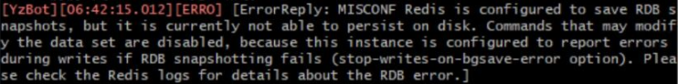

# 云崽 bot-v3 安装步骤

> 提醒一下大家，**Win7 系统的电脑是无法搭载云崽的**，并且如果您打算在云服务器上搭建，**请选择 Windows Server 2019 及以上版本**，不要选择 2012！  
> 不要选择 2012！！  
> 不要选择 2012！！！

## 本体安装步骤

> **下方密码统一为 0000**  
> **以下命令如果没有特别指明的话，都是在云崽根目录下执行**  
> **视频内的命令可能有误，一切步骤以本安装教程内的为准**

- 下载 node,git,redis [https://yshs.lanzouy.com/b09zk5u1g](https://yshs.lanzouy.com/b09zk5u1g)

- 下载安装云崽本体： `git clone --depth 1 -b main https://gitee.com/Le-niao/Yunzai-Bot.git`

- 进入文件夹

- 安装 pnpm： `npm install pnpm -g`

  - 问题：输完卡住不动了怎么办？或者提示 `npm ERR！`？或者其他的报错？  
    原因：你的服务器网络太差了，下载不动  
    解决方案：执行命令来更换淘宝镜像源 `npm config set registry https://registry.npm.taobao.org`  
    后遗症：更换镜像源后有微小概率导致后续安装出现问题，所以如果你更换了镜像源以后遇到任何问题请勿向我提问;w;

- 安装依赖： `pnpm install -P`

  >  <br>
  > 如果在这个地方卡住了，可以先执行 `pnpm config set puppeteer_download_host=https://npm.taobao.org/mirrors`  
  > 再 `pnpm install -P`

  >  <br>
  > 如果遇到这个问题，请执行以下操作：
  >
  > 1. 打开 `Yunzai-Bot\package.json` 删除 `"enka-network-api":"^1.0.1"` 以及上一行的最后末尾的一个**逗号**，删完长这样 ↓  
  >     <br>
  > 2. 打开 `Yunzai-Bot\plugins\genshin\apps` 删除 `enka.js`
  > 3. 再执行一次 `pnpm install -P`

  > 提示：pnpm: command not found?  
  > 你上一步的 pnpm 没装好或者安装报错了

- 首次启动使用 `node app` 命令

- 以后启动使用 `npm run start` 命令

  > 注：使用 `npm run start` 可能导致后台闪 cmd，如果不是在服务器搭建的话推荐使用 `node app` 命令启动云崽，效果差不多

- 一键启动脚本 [https://yshs.lanzouy.com/b09zlibch
  ](https://yshs.lanzouy.com/b09zlibch)

---

## 基础操作

- 启动云崽： `npm run start`

- 查看日志： `npm run log`

- 关闭云崽： `npm run stop`

- 功能列表： `#帮助`

- 更新云崽： `#全部更新`

---

## 目录说明

| 目录                     | 说明                           |
| ------------------------ | ------------------------------ |
| config\config\qq.yaml    | 可以修改登录方式，QQ 号        |
| config\config\other.yaml | 可以修改主人 QQ                |
| data\face                | 存放添加表情的位置             |
| data\MysCookie           | 存放 cookie 的位置             |
| plugins\example          | 存放 js 插件的位置             |
| Yunzai-Bot\plugins       | 存放大型插件的位置，如喵喵插件 |

## 额外说明

| 功能说明        | 样例                                                         | 备注                                                                                                                                                                                                                                                                                                        |
| --------------- | ------------------------------------------------------------ | ----------------------------------------------------------------------------------------------------------------------------------------------------------------------------------------------------------------------------------------------------------------------------------------------------------- |
| ffmpeg 配置样例 | `ffmpeg_path: 'D:\云崽v3测试别删\Yunzai-Bot\bin\ffmpeg.exe'` | 锅巴里直接填路径就好，比如 `D:\云崽v3测试别删\Yunzai-Bot\bin\ffmpeg.exe` 路径不能有空格，必须用单引号，必须用反斜杠。 ffmpeg 下载地址 [https://yshs.lanzouy.com/b09znfb7g](https://yshs.lanzouy.com/b09znfb7g)<br>p.s. 有些时候日志提示 `请检查ffmpeg配置` 可能是插件本身的问题，而不是你的 ffmpeg 没配置好 |

---

## 插件安装步骤

### 云崽插件库：[https://gitee.com/yhArcadia/Yunzai-Bot-plugins-index](https://gitee.com/yhArcadia/Yunzai-Bot-plugins-index)

### [喵喵插件](https://gitee.com/yoimiya-kokomi/miao-plugin)

- 喵喵插件安装命令：`git clone --depth 1 -b master https://gitee.com/yoimiya-kokomi/miao-plugin.git ./plugins/miao-plugin/`

- 喵喵依赖安装命令： `pnpm add image-size -w`

- 帮助菜单命令： `#喵喵菜单`

- 插件设置命令： `#喵喵设置`

### [锅巴插件](https://gitee.com/guoba-yunzai/guoba-plugin)

- 锅巴插件安装命令：`git clone --depth=1 https://gitee.com/guoba-yunzai/guoba-plugin.git ./plugins/Guoba-Plugin/`

- 锅巴依赖安装命令： `pnpm install --no-lockfile --filter=guoba-plugin -w`

- 外网登录的话需要在服务器后台放行端口，具体看 `#锅巴帮助`

- 帮助菜单命令： `#锅巴帮助`

### [逍遥插件(图鉴插件)](https://gitee.com/Ctrlcvs/xiaoyao-cvs-plugin)

- 逍遥插件安装命令：`git clone --depth=1 https://gitee.com/Ctrlcvs/xiaoyao-cvs-plugin.git ./plugins/xiaoyao-cvs-plugin/`

- 逍遥依赖安装命令： `pnpm add promise-retry -w` 再 `pnpm add superagent -w`

- 安装完需要先 `#图鉴更新` 一次

- 帮助菜单命令： `#图鉴菜单`

- 插件设置命令： `#图鉴设置`

### [py 插件(宵鸟插件)](https://gitee.com/realhuhu/py-plugin)

- 安装依赖 `pnpm add @grpc/grpc-js -w` 再 `pnpm add @grpc/proto-loader -w`

- 安装 python 3.8.8 [https://yshs.lanzouy.com/b09zlrj8f](https://yshs.lanzouy.com/b09zlrj8f)

  > 注意安装时需要勾选 `Add Python 3.8 to PATH`

- py 插件安装命令： `git clone --depth=1 https://gitee.com/realhuhu/py-plugin.git ./plugins/py-plugin/`

- 进入 **Yunzai-Bot\plugins\py-plugin** 在这个目录下点击地址栏，把地址删掉，并输入 cmd，然后回车，会打开一个 cmd 窗口。在打开的 cmd 窗口里输入 `python install` 然后回车，从而安装依赖

  - 对自己家网络质量没信心的同学可以先换成中科大镜像源再执行 `python install` ，换源命令： `pip config set global.index-url https://pypi.mirrors.ustc.edu.cn/simple` ，换回默认源方法：删除 `C:\Users\你自己的电脑名字\AppData\Roaming\pip` 文件夹
    

- **把 cmd 窗口关了，然后按相同的步骤再开一次 cmd。** 然后输入 `poetry install` 再回车

> **如果 node app 启动时提示「python 服务器启动失败」，那么请删掉 Yunzai-Bot\plugins\py-plugin 文件夹，然后再在云崽根目录下执行 `git clone --depth=1 https://gitee.com/realhuhu/py-plugin.git ./plugins/py-plugin/` 再 node app 启动就行，无需重新安装依赖**  
> **如果使用以上方法以后还是启动失败，请检查服务器是否为 Windows Server 2012 ，如果是的话，那挺正常的，2012BUG 很多**

- 帮助菜单命令： `#py帮助`

- 详细帮助菜单： `#py插件管理帮助`

> py 插件安装很容易出错，如果有别的问题请联系我

### [js 格式插件通用安装方法](https://gitee.com/yhArcadia/Yunzai-Bot-plugins-index?_from=gitee_search#js%E6%8F%92%E4%BB%B6%E7%B4%A2%E5%BC%95)

- 很简单，将插件下载好后放入 `Yunzai-bot/plugins/example` 里即可 

---

## 常用命令

- [云崽本体常用命令](https://github.com/Le-niao/Yunzai-Bot/tree/main/plugins/genshin)

---

## 尚未解决的问题

- 手机上获取的 cookie 发给机器人，会提示绑定 cookie 提示失败。可以尝试用桌面版网页获取 cookie，具体有没有效果我也不知道

-  <br> MISCONF 啥啥啥的，遇到这个问题请私聊我

---

## 常见问题

- 遇到任何问题请带上[日志](#基础操作)来提问： `npm run log`

  - 

- 米游社接口报错，暂时无法查询：error

  - [https://docs.qq.com/doc/DTnB4Qkh1RGRCeVFU](https://docs.qq.com/doc/DTnB4Qkh1RGRCeVFU)

- 装完 node 但是还是提示 `npm:command not found`

  - 自行百度 `npm环境变量设置`

- 签到显示 `验证码失败` ?

  - 正常，米游社签到有概率出现验证码，无解

- 提示 `qq版本过低` ？

  -  <br>此图来源于喵喵插件群

- 提示 `请配置公共ck` ？

  - `#配置ck` 再发送自己的 cookie

- 公共 ck 查询次数已用完，暂无法查询新 uid？

  - `#使用全部ck`

- `node app` 后提示 puppeteer chromium 启动失败？

  1. 执行 `pnpm config set puppeteer_download_host=https://npm.taobao.org/mirrors`
  2. 删除 `Yunzai-Bot\node_modules\puppeteer` 下的 `.local-chromium` 文件夹 (没有就无视这一步)
  3. 执行 `node ./node_modules/puppeteer/install.js`
  4. 正常启动即可

- V3 经常掉 cookie 但是 V2 都很正常？

  - 需打开 Reids 的 AOF 持久化功能：
    > 执行如下操作：  
    > #修改 redis.windows.conf 配置文件
    > 搜索找到 appendonly  
    > 把 appendonly no 改成 appendonly yes

- ErrorReply: MISCONF Redis is configured to save RDB
  snapshots

  - 可能是因为 Redis 权限不足导致的，请重启电脑后将 Redis 剪切到另一个盘后打开即可(如果你是服务器遇到这个问题请私聊我)

- 下载安装云崽本体提示 `could not create work tree dir` ？ 或者 `计算机积极拒绝连接` ？

  - 换一个盘安装

- redis 数据库打不开怎么办？

  - 在 redis 目录下建一个名称为 start.txt 文本，打开输入`redis-server.exe redis.conf`并且保存。修改后缀名为 bat(修改后名为 start.bat )，双击打开 start.bat 即可。
  - 还是打不开的话，打开 redis-cli.exe，输入`shutdown`，回车，输入`exit`，回车，再去打开 start.bat，正常来说就可以了。

- 输完密码提示：需要获取滑动验证码 ticket？

  - [点击跳转教程](https://www.bilibili.com/video/BV1zG411H7ya?p=3&vd_source=bf9c20c0e1f6ece1b8ee30dc70a2cb8f&t=232.5)

- 登录有风险，无法登陆? 登陆需要密保手机扫二维码验证，但是二维码刷新不出来？

  - 可以改用扫码登录。再不行就服务器先开着 QQ，挂几分钟再退出登录，然后再登录，重复三四遍再试试能不能登录，还是不行的话就最后再挂几个小时，再看看能不能登录。

- `#更新面板` 用不了？ `#更新面板` 显示服务器负载过高？

  - 解决办法：进入`Yunzai-Bot\plugins\miao-plugin\config`文件夹，找到`profile_default`文件，复制粘贴一份，并将新的那一份改名为`profile`，右键编辑`profile`，找到

    ```js
    export const enkaApi = {
      url: "https://enka.network/", // 请求API地址，可从上方提供的API地址中进行选择
      proxyAgent: "", // 请求的proxy配置，如无需proxy则留空
    };
    ```

    将 `url: 'https://enka.network/` 改为 `url: 'https://enka.microgg.cn/`
    **最后保存重启即可**

    - 改完还是不行？
      - 我的建议是，**等修复**

- 怎么启动/关闭机器人?

  - **启动：** 在云崽根目录下打开 git bash 输入 `npm run start`
  - **关闭：** 对着机器人发送 `#关机`

- 机器人进群自动退了怎么办

- 如何删除插件?

  - 在 `Yunzai-bot/plugins` 文件夹里找到对应的插件右键删除即可

- 如何关闭入群欢迎?

  - 在 `Yunzai-bot/plugins/example` 文件夹里找到入群欢迎插件，右键删除

- 签到提示 `验证码失败` ？

  - 很遗憾，目前无解

- 机器人被冻结了，怎么办？

  - 没啥好办法，这是 QQ 的问题，可以多备几个小号。关闭私聊，减少冻结频率。

- xx 功能报错，xx 功能异常？机器人打不开? 机器人坏了?

  - 重置云崽步骤(数据会保留)：在云崽根目录下打开 git bash 输入`git pull`，然后再`git reset --hard origin/main`，最后再手动重启即可解决。

- 喵喵插件的 `#xx照片` `xx图片` 功能用不了？

  -  把 `Yunzai-Bot/plugins/miao-plugin/resources` 的 `character-img` 文件复制一份到 `Yunzai-Bot/plugins/miao-plugin/resources/miao-res-plus` 里就好

- 机器人群聊消息发不出去，但是私聊正常？

  - 这是触发了 QQ 新版群聊风控，私聊机器人发送 <https://accounts.qq.com/safe/message/unlock?lock_info=5_5> 然后拿出你的手机，并登录机器人的手机 QQ，从机器人的手机 QQ 里打开个链接，验证就行了。

- 安卓怎么挂机器人？

  - [安卓教程](https://www.bilibili.com/video/BV1oe4y187Pb)

- 服务器推荐？

  - 平时服务器都会比较贵，只有新用户和购物节会特别便宜，所以大家各凭本事吧，反正只要服务器能联网就能搭这个机器人。

- 插件除了这些还有别的吗
  - 更多的插件都在云崽官方群里，但是官方群它不对外开放...
